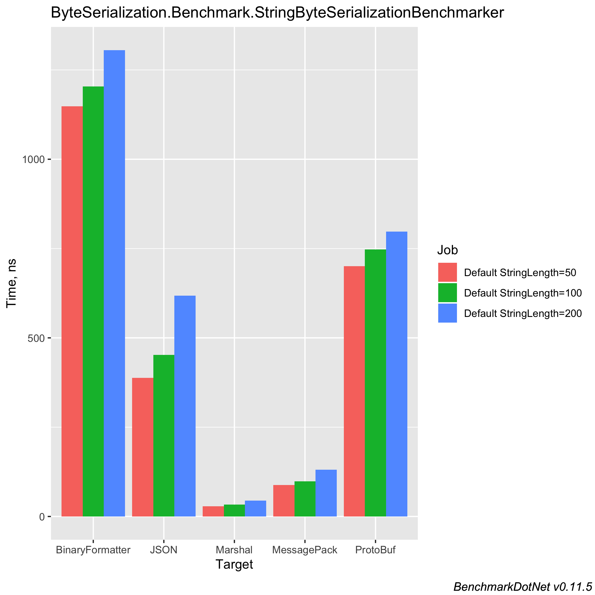

# Object-to-bytes in C#

While trying to improve the speed of [Maybe.NET](https://github.com/rmc00/Maybe), I discovered that 80-90%
of the CPU time was spent on serializing objects into byte arrays before feeding them into a hashing function,
hat only works on byte arrays.

`Maybe.NET` uses `BinaryFormatter` for serializing objects into byte arrays - does a better method exist?
Let's investigate!

## Why is `BinaryFormatter` so slow?

@TODO

## Alternatives to `BinaryFormatter`

A quick search on Google and StackOverflow reveals many interesting alternatives to `BinaryFormatter`:

* _Serializing the objects into JSON_: @TODO
* _Using ProtoBuf_: @TODO
* _Using MessagePack_: https://github.com/neuecc/MessagePack-CSharp
* @TODO more?


## Benchmarking implementations

Before we can benchmark anything, we have to create whatever we're going to benchmark first (duh).

We want to benchmark different ways of converting an object to a byte array - therefore, we define an interface for the required functionality first.

@TODO - insert byteconverterinterface

Using the identified alternatives to the `BinaryFormatter`, and the `BinaryFormatter` itself, we create implementations of the interface like this:

@TODO - insert example of interface implementation with the binary formatter

All that's left now is to write the benchmarking code itself:

@TODO insert benchmarking code

## Benchmark results

When running the benchmark code on my machine, the following results are produced:

### Benchmarking with `string`s



``` ini

BenchmarkDotNet=v0.11.5, OS=macOS Mojave 10.14.5 (18F203) [Darwin 18.6.0]
Intel Core i7-8850H CPU 2.60GHz (Coffee Lake), 1 CPU, 12 logical and 6 physical cores
.NET Core SDK=2.2.300
  [Host]     : .NET Core 2.2.5 (CoreCLR 4.6.27617.05, CoreFX 4.6.27618.01), 64bit RyuJIT
  Job-XRVZPW : .NET Core 2.2.5 (CoreCLR 4.6.27617.05, CoreFX 4.6.27618.01), 64bit RyuJIT

Runtime=Core  Toolchain=netcoreapp2.1  

```
|          Method | StringLength |        Mean |      Error |     StdDev | Ratio | Rank |  Gen 0 | Gen 1 | Gen 2 | Allocated |
|---------------- |------------- |------------:|-----------:|-----------:|------:|-----:|-------:|------:|------:|----------:|
|         Marshal |           50 |    28.89 ns |  0.5974 ns |  0.8941 ns |  0.03 |    1 | 0.0271 |     - |     - |     128 B |
|     MessagePack |           50 |    88.20 ns |  0.5547 ns |  0.4917 ns |  0.08 |    2 | 0.0169 |     - |     - |      80 B |
|            JSON |           50 |   388.26 ns |  1.8003 ns |  1.5959 ns |  0.34 |    3 | 0.3085 |     - |     - |    1456 B |
|        ProtoBuf |           50 |   700.38 ns |  4.0060 ns |  3.7472 ns |  0.61 |    4 | 0.1354 |     - |     - |     640 B |
| BinaryFormatter |           50 | 1,148.06 ns | 10.0069 ns |  9.3605 ns |  1.00 |    5 | 0.5913 |     - |     - |    2792 B |
|                 |              |             |            |            |       |      |        |       |       |           |
|         Marshal |          100 |    33.28 ns |  0.7370 ns |  1.1689 ns |  0.03 |    1 | 0.0474 |     - |     - |     224 B |
|     MessagePack |          100 |    98.11 ns |  0.6833 ns |  0.6392 ns |  0.08 |    2 | 0.0271 |     - |     - |     128 B |
|            JSON |          100 |   452.06 ns |  3.2072 ns |  2.8431 ns |  0.38 |    3 | 0.3390 |     - |     - |    1600 B |
|        ProtoBuf |          100 |   747.12 ns |  5.1617 ns |  4.8283 ns |  0.62 |    4 | 0.1450 |     - |     - |     688 B |
| BinaryFormatter |          100 | 1,203.48 ns | 17.4695 ns | 16.3410 ns |  1.00 |    5 | 0.6008 |     - |     - |    2840 B |
|                 |              |             |            |            |       |      |        |       |       |           |
|         Marshal |          200 |    44.44 ns |  0.7150 ns |  0.6688 ns |  0.03 |    1 | 0.0898 |     - |     - |     424 B |
|     MessagePack |          200 |   130.57 ns |  0.8277 ns |  0.7337 ns |  0.10 |    2 | 0.0491 |     - |     - |     232 B |
|            JSON |          200 |   617.95 ns | 10.2881 ns |  9.6235 ns |  0.47 |    3 | 0.4034 |     - |     - |    1904 B |
|        ProtoBuf |          200 |   797.10 ns |  5.6800 ns |  5.0351 ns |  0.61 |    4 | 0.1669 |     - |     - |     792 B |
| BinaryFormatter |          200 | 1,305.44 ns | 11.8983 ns | 10.5476 ns |  1.00 |    5 | 0.6237 |     - |     - |    2944 B |


### Benchmarking with complex types


``` ini

BenchmarkDotNet=v0.11.5, OS=macOS Mojave 10.14.5 (18F203) [Darwin 18.6.0]
Intel Core i7-8850H CPU 2.60GHz (Coffee Lake), 1 CPU, 12 logical and 6 physical cores
.NET Core SDK=2.2.300
  [Host]     : .NET Core 2.2.5 (CoreCLR 4.6.27617.05, CoreFX 4.6.27618.01), 64bit RyuJIT
  Job-XRVZPW : .NET Core 2.2.5 (CoreCLR 4.6.27617.05, CoreFX 4.6.27618.01), 64bit RyuJIT

Runtime=Core  Toolchain=netcoreapp2.1  

```
|          Method |       Mean |     Error |    StdDev | Ratio | Rank |  Gen 0 | Gen 1 | Gen 2 | Allocated |
|---------------- |-----------:|----------:|----------:|------:|-----:|-------:|------:|------:|----------:|
|        ProtoBuf |   3.165 μs | 0.0325 μs | 0.0288 μs |  0.03 |    1 | 0.4959 |     - |     - |   2.29 KB |
|     MessagePack |   3.922 μs | 0.0264 μs | 0.0247 μs |  0.03 |    2 | 0.3662 |     - |     - |    1.7 KB |
|            JSON |  26.035 μs | 0.2748 μs | 0.2436 μs |  0.21 |    3 | 1.8616 |     - |     - |   8.66 KB |
| BinaryFormatter | 122.529 μs | 1.5204 μs | 1.2696 μs |  1.00 |    4 | 9.0332 |     - |     - |  41.67 KB |

### Results summary

Agenda:

* What does this repo contain?
    * Implementations of object-to-bytes serialization methods
    * Benchmarks of those
* Why does the repo contain this? (background)
