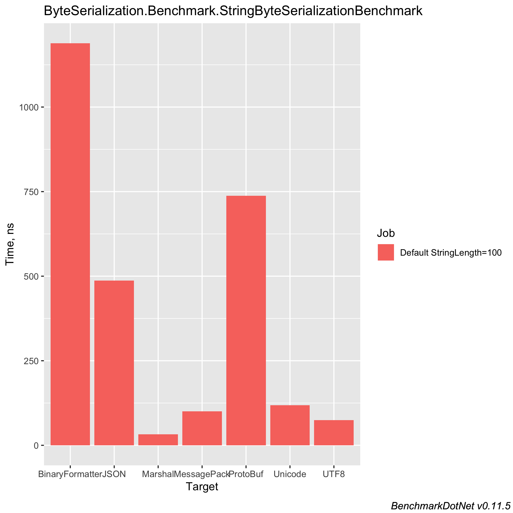

# Object-to-bytes in C#

While trying to improve the speed of [Maybe.NET](https://github.com/rmc00/Maybe), I discovered that 80-90%
of the CPU time was spent on serializing objects into bytes before feeding them into a hashing function.

`Maybe.NET` uses `BinaryFormatter` for serializing objects into byte arrays - does a better method exist?
Let's investigate!

<!-- ## @TODO Why is `BinaryFormatter` so slow? -->

## Alternatives to `BinaryFormatter`

A quick search on Google and StackOverflow reveals many interesting alternatives to `BinaryFormatter`:

* _Through JSON_: Serializing the object into a JSON string and then convert the string into a bytes.
* _Using ProtoBuf_: Using the [protobuf-net](https://github.com/mgravell/protobuf-net) NuGet package, which implements Google's [Protocol buffers](https://developers.google.com/protocol-buffers/) to serialize objects into bytes.
* _Using MessagePack_: By using [MessagePack](https://github.com/neuecc/MessagePack-CSharp), which is supposedly an _extremely_ fast serializer for C#.

As I have a very specific use case concerning serialization of `string`s, a few `string`-specific serialization methods have been included: 

* `string`s only:
    * _Marshal_: By copying the `string` directly from memory into a byte array
    * _UTF8_: By using the `Encoding.UTF8.GetBytes` method
    * _Unicode (UTF16)_: By using the `Encoding.Unicode.GetBytes` method


## Benchmarking implementations

Before we can benchmark anything, we have to create whatever we're going to benchmark first (duh).

### Creating the implementations

We want to benchmark different ways of converting an object to a byte array - therefore, we define an interface for the required functionality first.

``` csharp
public interface IByteConverter<T>
{
    byte[] GetBytes(T objectToSerialize);
    T GetObject(byte[] objectToDeserialize);
}
```

Using the `BinaryFormatter` itself and the identified alternatives, we create implementations of the interface like this:

``` csharp
public class BinaryFormatterByteConverter<T> : IByteConverter<T>
{
    private readonly BinaryFormatter _binaryFormatter;

    public BinaryFormatterByteConverter()
    {
        _binaryFormatter = new BinaryFormatter();
    }

    public byte[] GetBytes(T objectToSerialize)
    {
        using (var ms = new MemoryStream())
        {
            _binaryFormatter.Serialize(ms, objectToSerialize);
            return ms.ToArray();
        }
    }

    public T GetObject(byte[] objectToDeserialize)
    {
        using (var ms = new MemoryStream(objectToDeserialize))
        {
            return (T) _binaryFormatter.Deserialize(ms);
        }
    }
}
```

### Creating the benchmarking code

All that's left now is to write the benchmarking code itself.

[BencharkDotNet](https://github.com/dotnet/BenchmarkDotNet) - an awesome library for benchmarking .NET code - is used for benchmarking the implementations of the `IByteConverter<T>`.

The implementations are benchmarks with `T` being `string` and a custom type called `ComplexType`, which holds an object graph.

The `string` benchmark of the `BinaryFormatterByteConverter` looks like this: 


``` csharp
...
[GlobalSetup(Target = nameof(BinaryFormatterByteConverterBenchmark))]
public void Setup_BinaryFormatterByteConverter()
{
    Converter = new BinaryFormatterByteConverter<string>();
    TestString = GetTestString();
}

[Benchmark(Baseline = true, Description = "BinaryFormatter")]
public void BinaryFormatterByteConverterBenchmark()
{
    var bytes = Converter.GetBytes(TestString);
}
...
```
## Benchmark results

When running the benchmark code on my machine, the following results are produced:

### Benchmarking with `string`

#### Results


``` ini

BenchmarkDotNet=v0.11.5, OS=macOS Mojave 10.14.5 (18F203) [Darwin 18.6.0]
Intel Core i7-8850H CPU 2.60GHz (Coffee Lake), 1 CPU, 12 logical and 6 physical cores
.NET Core SDK=2.2.300
  [Host]     : .NET Core 2.2.5 (CoreCLR 4.6.27617.05, CoreFX 4.6.27618.01), 64bit RyuJIT
  Job-UNMZYR : .NET Core 2.2.5 (CoreCLR 4.6.27617.05, CoreFX 4.6.27618.01), 64bit RyuJIT

Runtime=Core  Toolchain=netcoreapp2.1  

```
|          Method | StringLength |        Mean |      Error |     StdDev | Ratio | Rank |  Gen 0 | Gen 1 | Gen 2 | Allocated |
|---------------- |------------- |------------:|-----------:|-----------:|------:|-----:|-------:|------:|------:|----------:|
|         Marshal |          100 |    32.24 ns |  0.6299 ns |  0.5892 ns |  0.03 |    1 | 0.0474 |     - |     - |     224 B |
|            UTF8 |          100 |    74.14 ns |  0.2456 ns |  0.2177 ns |  0.06 |    2 | 0.0271 |     - |     - |     128 B |
|     MessagePack |          100 |   100.74 ns |  0.4471 ns |  0.4183 ns |  0.08 |    3 | 0.0271 |     - |     - |     128 B |
|         Unicode |          100 |   118.63 ns |  0.7008 ns |  0.6212 ns |  0.10 |    4 | 0.0474 |     - |     - |     224 B |
|            JSON |          100 |   487.11 ns |  2.8129 ns |  2.4936 ns |  0.41 |    5 | 0.3386 |     - |     - |    1600 B |
|        ProtoBuf |          100 |   737.57 ns |  6.1722 ns |  5.4715 ns |  0.62 |    6 | 0.1450 |     - |     - |     688 B |
| BinaryFormatter |          100 | 1,188.71 ns | 12.7686 ns | 11.3190 ns |  1.00 |    7 | 0.6008 |     - |     - |    2840 B |

#### Results discussion
The performance comparison of the implementations of `IByteConverter<T>`, where `T` is `string`, has a clear winner: `Marshal`.
`Marshal` uses only 3% of the time used by `BinaryFormatter` (the absolute loser) for converting a `string` to bytes!


### Benchmarking with complex types


``` ini

BenchmarkDotNet=v0.11.5, OS=macOS Mojave 10.14.5 (18F203) [Darwin 18.6.0]
Intel Core i7-8850H CPU 2.60GHz (Coffee Lake), 1 CPU, 12 logical and 6 physical cores
.NET Core SDK=2.2.300
  [Host]     : .NET Core 2.2.5 (CoreCLR 4.6.27617.05, CoreFX 4.6.27618.01), 64bit RyuJIT
  Job-UNMZYR : .NET Core 2.2.5 (CoreCLR 4.6.27617.05, CoreFX 4.6.27618.01), 64bit RyuJIT

Runtime=Core  Toolchain=netcoreapp2.1  

```
|          Method |       Mean |     Error |    StdDev | Ratio | Rank |  Gen 0 | Gen 1 | Gen 2 | Allocated |
|---------------- |-----------:|----------:|----------:|------:|-----:|-------:|------:|------:|----------:|
|        ProtoBuf |   3.188 μs | 0.0123 μs | 0.0115 μs |  0.03 |    1 | 0.4959 |     - |     - |   2.29 KB |
|     MessagePack |   3.859 μs | 0.0321 μs | 0.0300 μs |  0.03 |    2 | 0.3662 |     - |     - |    1.7 KB |
|            JSON |  26.522 μs | 0.2068 μs | 0.1833 μs |  0.23 |    3 | 1.8616 |     - |     - |   8.66 KB |
| BinaryFormatter | 116.973 μs | 0.4336 μs | 0.3621 μs |  1.00 |    4 | 9.0332 |     - |     - |  41.67 KB |


### Results summary

Agenda:

* What does this repo contain?
    * Implementations of object-to-bytes serialization methods
    * Benchmarks of those
* Why does the repo contain this? (background)
